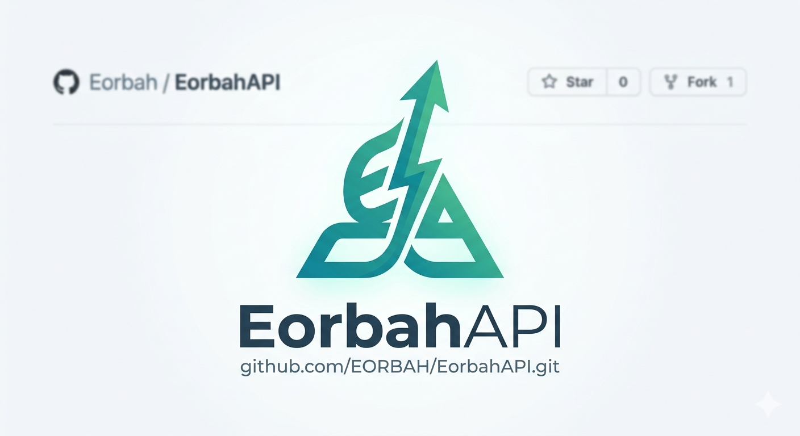

<div align="center">
  
  <h1>EorbahAPI</h1>
  <p>Libraries pour la créeation d'applications web et API pour php</p>
  
</div>

<br>

**EorbahAPI** est un framework web PHP moderne, rapide et haute performance, conçu pour construire des API avec une syntaxe épurée, inspiré de frameworks modernes comme Express.js et FastAPI.

## Documentation

Une documentation complète est disponible au [dossier docs](/docs/Index.md). Explorez des guides détaillés, des exemples et des tutoriels pour tirer le meilleur parti de la library.

## Installation

Install depuis packagist avec composer.

```bash
composer require eor_bah545/eorbahapi # non disponible via composer
```

Vous pouvez egalement utiliser github

```bash
git clone https://github.com/EORBAH/EorbahAPI.git
cd EorbahAPI
composer install
```

## Usage

La librairy EorbahAPI est rapide et intuitif cette version est propice au petit projet. Pour un ensemble complet d'exemples illustrant les capacités de la librairy, notamment les APIS, la conception d'applicatio, et bien plus encore, reportez vous au [dossier examples](/examples).


## License

La librairy est distribué sous la license Apache-2.0.

## Contributing

Consulter la [documentation](/CONTRIBUTING.md) sur la contribution à ce projet.